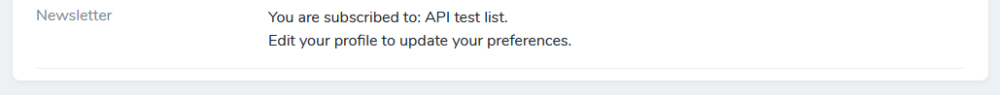
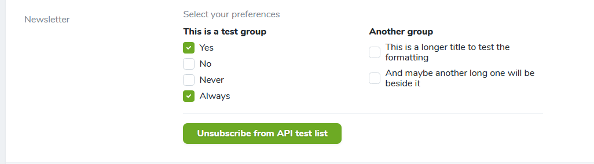

# A Laravel Nova Field for Mailchimp subscriptions

[](https://packagist.org/packages/riclep/nova-mailchimp-field)
[](https://packagist.org/packages/riclep/nova-mailchimp-field)


## Introduction

This package creates a new field that allows Users to manage their Mailchimp subscription preferences. It has basic support for Mailchimp Groups allowing Users to select their interests.

## Installation

You can install this Laravel [Nova](https://nova.laravel.com) field via composer:

```bash
composer require riclep/nova-mailchimp-field
```

It uses the [Spatie newsletter](https://github.com/spatie/laravel-newsletter) package, so after installing ensure this has been set up correctly.


```php
// in your Nova Resource

NovaMailchimpField::make('Newsletter')->withMeta(['emailAddress' => $this->email])->fillUsing(function() {
	return;
}),
```

## Screenshots



